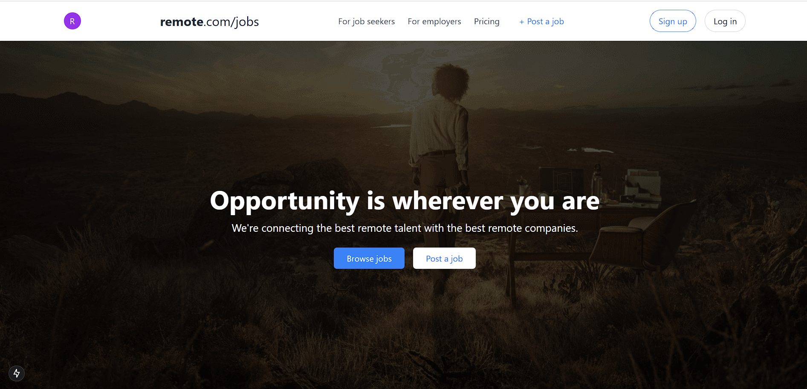
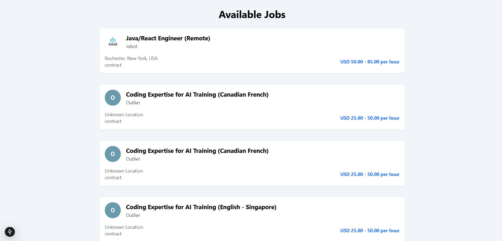
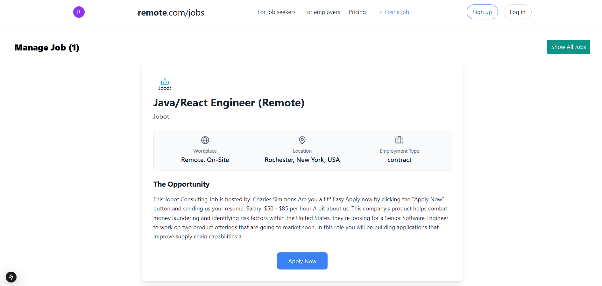
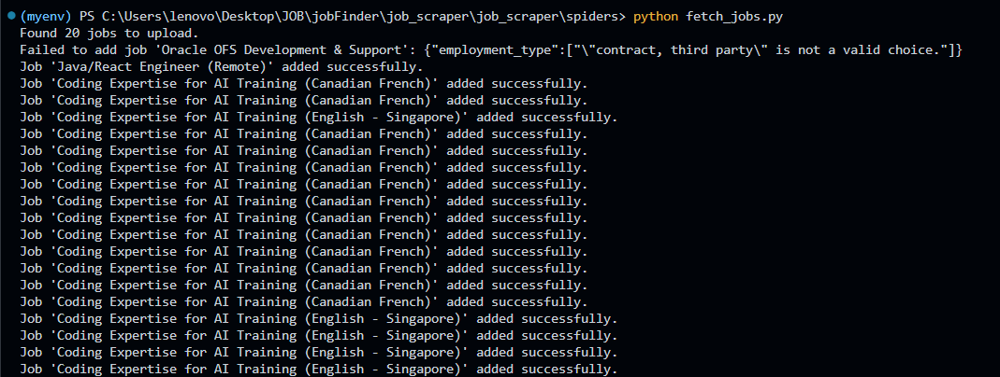
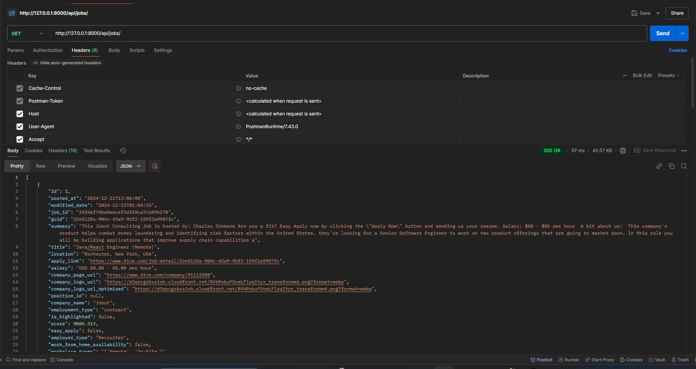
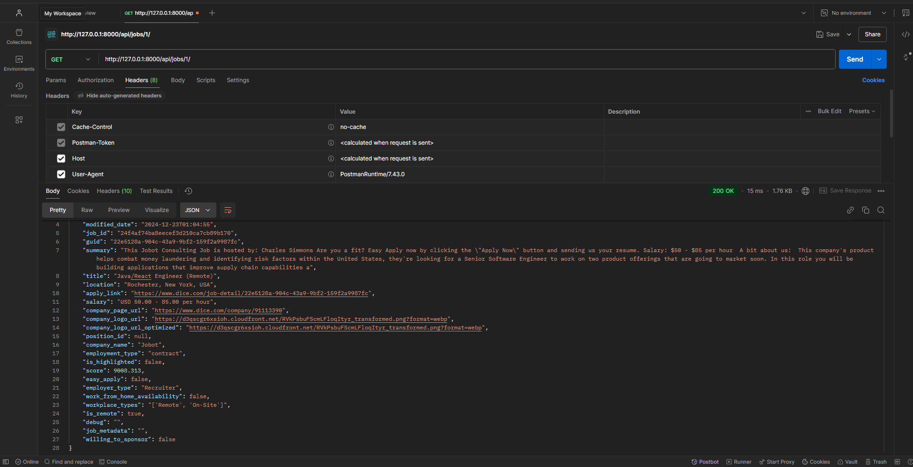

# Job Listing Web Application

This repository contains the implementation of a **Job Listing Website**, built as part of a full-stack development assignment. The application integrates a Django REST Framework backend, a Next.js frontend, and a Python scraper to fetch and manage job data.

---

## Features

### Backend (Django REST Framework)

- **GET API**: Retrieves job data from a MySQL database.
- **POST API**: Allows insertion of new job data into the MySQL database.

### Scraper (Scrapy)

- Scrapes job listing data from [Dice](https://www.dice.com/jobs?q=Software&radius=30&radiusUnit=mi&page=1&pageSize=20&filters.postedDate=ONE&filters.workplaceTypes=Remote&filters.employmentType=CONTRACTS&currencyCode=USD&language=en).
- Handles pagination to collect comprehensive job data.
- Sends a POST request to the backend API to insert the scraped data.

### Frontend (Next.js)

- Built with **Next.js** and styled using **Tailwind CSS**.
- Displays job listings retrieved from the backend in a structured and user-friendly interface.
- Responsive and modern UI inspired by [Remote](https://remote.com/jobs/all).

---

## Prerequisites

Ensure you have the following installed:

1. **Backend**

   - Python 3.x
   - Django 4.x
   - Django REST Framework
   - MySQL

2. **Frontend**

   - Next.js
   - Tailwind CSS (optional)

3. **Scraper**
   - Python 3.x
   - Scrapy

---

## Installation and Setup

### Backend Setup

1. Clone the repository:

   ```bash
   git clone <repository-url>
   cd backend
   ```

2. Install dependencies:

   ```bash
   pip install -r requirements.txt
   ```

3. Configure the MySQL database in `settings.py`:

   ```python
    DATABASES = {
        "default": {
            "ENGINE": "django.db.backends.mysql",
            "NAME": "job_listing_db",
            "USER": "root",
            "PASSWORD": "",
            "HOST": "localhost",
            "PORT": "3306",
            'OPTIONS': {
                'init_command': "SET default_storage_engine=INNODB; SET SESSION innodb_strict_mode=1; SET GLOBAL innodb_file_per_table=1; SET   innodb_file_format=Barracuda;",
            }
        }

   }
   ```

4. Apply migrations:

   ```bash
   python manage.py makemigrations
   python manage.py migrate
   ```

5. Run the server:
   ```bash
   python manage.py runserver
   ```

### Scraper Setup

1. Navigate to the `scraper` directory:

   ```bash
   cd scraper
   ```

2. Install Scrapy:

   ```bash
   pip install scrapy
   ```

3. Run the scraper:

   ```bash
   scrapy crawl job_spider
   ```

   ```bash
   python fetch_jobs.py
   ```

4. Ensure the scraped data is posted to the backend API for insertion into MySQL.

### Frontend Setup

1. Navigate to the `frontend` directory:

   ```bash
   cd frontend
   ```

2. Install dependencies:

   ```bash
   npm install
   ```

3. Start the development server:
   ```bash
   npm run dev
   ```

---

## Usage

1. Access the frontend at `http://localhost:3000`.
2. Browse job listings fetched from the backend.
3. Scrape new job data using the scraper and verify it appears in the frontend.

---

## Screenshots

### 1. Home Page



### 2. Job Listing Page



### 3. Single Job Listing Page



### 3. API Testing







_(Ensure to replace the placeholders above with the actual paths to your screenshots.)_

---

## Contributing

Feel free to fork this repository and submit pull requests for any improvements or bug fixes.

---

## Contact

For any queries or issues, feel free to reach out:

- Email: ayush9334kumar@gmail.com
